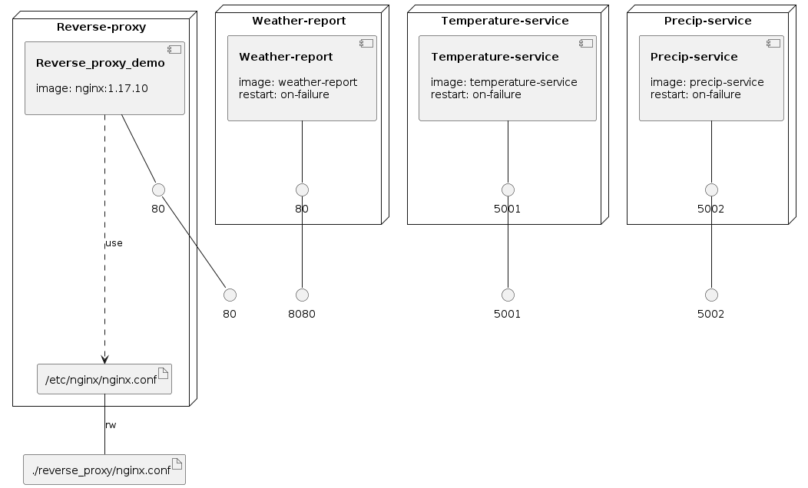

# Minimal nginx reverse proxy demo

This repository contains a `docker-compose` orchestrated application with Flask and Vue services running behind an nginx reverse proxy.

## Warning

This application and its services are not production ready, and is not propely configured for deployment. It serves only as a basic starting point to configure nginx and orchestrate several services with `docker-compose`.

## Running

To build the containers:
`docker-compose build`

To run the containers:
`docker-compose up`

## Oversimplified Diagram

### Infrastructure model

